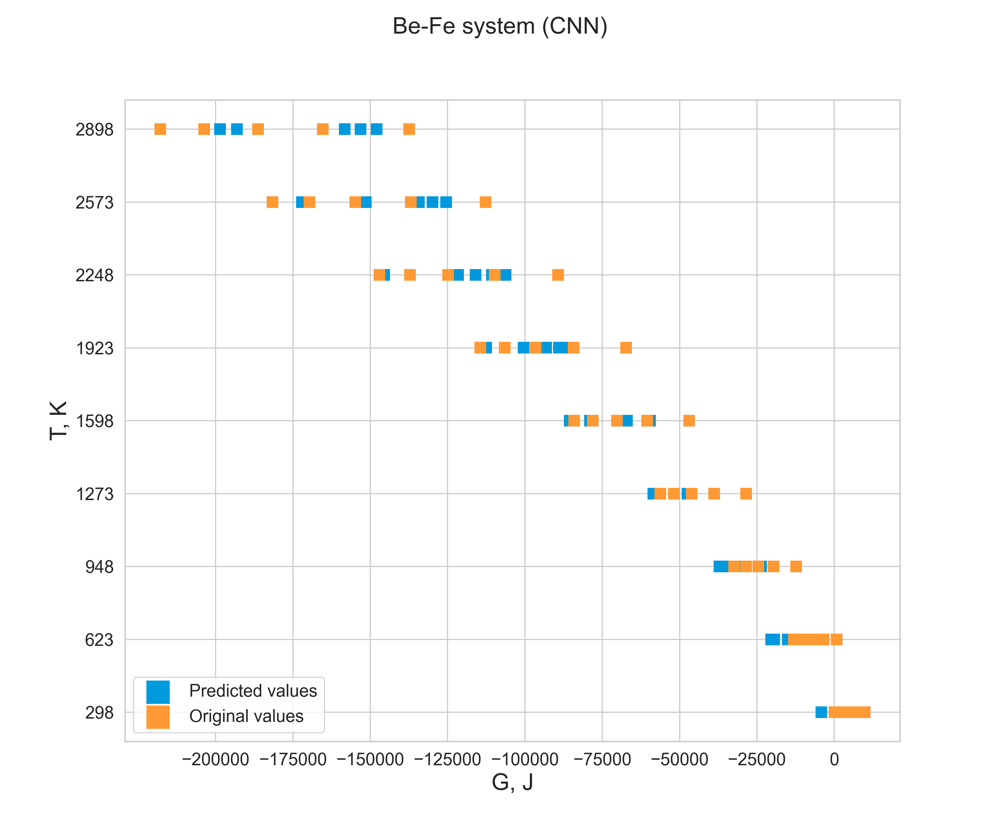

# Gibbs-energy-prediction-model

This code, models, and sample data are part of the research and graduate thesis. With the help of this model, the possibility of fast and sufficiently accurate prediction of the minimum value of the Gibbs energy, as one of the factors of thermodynamic equilibrium. The model was created for metallic systems with small amounts of selected alloying components.

The model is represented by a neural network based on two architectures - a deep neural network and a convolutional neural network.

The data for model training was generated by the pycalphad with a custom multicomponent database artificially generated in the CALPHAD database format. It is also worth noting that it was not possible to obtain training data for all combinations of components used, so depending on the components, the accuracy of the model may be lower in some cases. Example, is not an absolute true for these components: data were available for Al-Mg and Mg-V, but not for Al-V.

Only binary systems were used for training, and accuracy checks were also performed for ternary systems.

The data format used for model training and prediction is as follows:

| index of vector| | feature |
|-----|---|------|
| [0] | - | temperature |
| [1] | - | concentration of Al |
| [2] | - | concentration of Mg |
| [3] | - | concentration of V |

> Example: [298.15, 0.95, 0.05, 0, 0, 0, 0, 0......] a vector of 57 elements

### Used elements in phase equilibrium calculations:
---

Elements that were used in the process of generating the necessary data:

>LI, BE, NA, MG, AL, K, CA, SC, TI, V, CR, MN, FE, CO, NI, CU, ZN, GA, Y, ZR, NB, MO, TC, RH, PD, AG, CD, IN, SN, BA, LA, CE, PR, ND, PM, SM, EU, GD, TB, DY, HO, ER, HF, TA, W, RE, OS, IR, PT, AU, HG, TL, PB, BI, C, SI

## Project structure
---

* data samples - examples of generated data on the basis of which the vector for model training is built 
* errors - for which combinations it was not possible to use the data for training
* models - final versions of the model after training and hold-out validation
* src - code written for this work

## Requirements
---

* python 3.10.6
* pandas 1.5.3
* scikit-learn 1.2.2
* tensorflow 2.11.0
* matplotlib 3.7.0
* numpy 1.24.2
* pycalphad 0.10.2
* seaborn 0.12.2

## Quick start (pip install commands)
---

```bash 
pip install matplotlib==3.7.0 
pip install numpy==1.24.2  
pip install pandas==1.5.3
pip install pycalphad==0.10.2
pip install tensorflow==2.11.0 
pip install scikit-learn==1.2.2
pip install seaborn==0.12.2
```

## Results
---
The results for some cases are shown below. The rest of the results of the work will be added later.

### Binary systems (example)

|R^2|MSE|RMSE|
|---|---|----|
|96.9 %|123339766|11105|



### Ternary systems (example)

|R^2|MSE|RMSE|
|---|---|----|
|98.3 %|65110443|8069|

